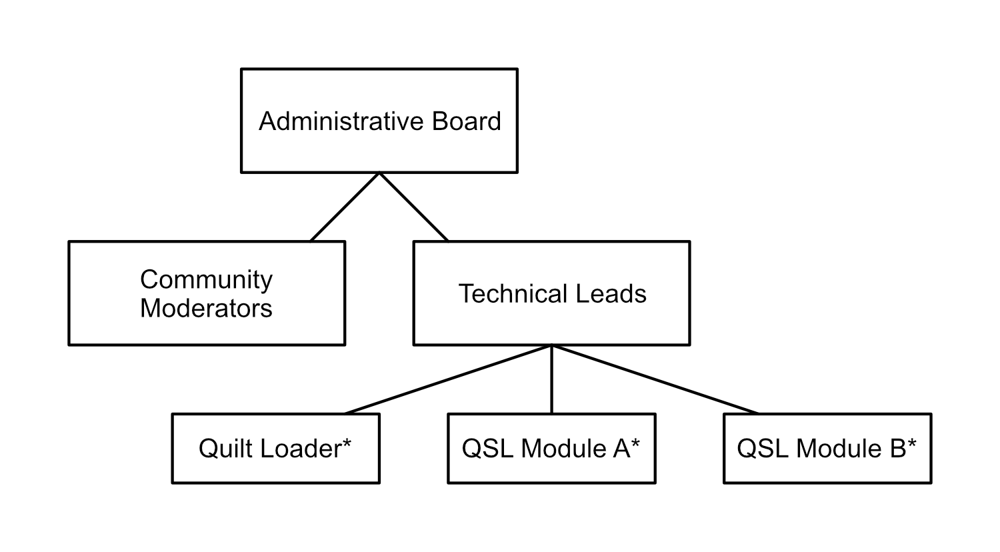

# Summary
This document is intended to detail the governing structure of the Quilt project.

# Motivation
This document has been written with the explicit purpose of defining guidelines and expectations for project staff. It has been written with the idea of decentralizing power in mind, to help contribute to the goal of a truly open project.

# Explanation

## Governmental Structure

\* For illustration purposes only, technical teams may vary

### Teams
A team is a group of staff members dedicated to solving a specific issue, maintaining a specific subproject, or overseeing a specific area. A team may be made up of any number of staff members, and a staff member may be on any number of teams. Teams may be community-focused, such as community moderators, or technically focused, such as the team of developers responsible for Quilt Loader. Team member responsibilities will vary and be detailed on a team-by-team basis.

Each team will be initially constructed by the parent team responsible for that team. Further appointments will be voted upon by team members.

#### Voting
When a vote is called within a team, each member of that team may choose to vote for any of the available options or abstain. The option with the plurality of votes wins. Members of supervising teams may choose to participate in votes. In the event of a tie, members of the parent team may choose to vote if they haven't already, with each of their votes being worth three votes.

### Removal of Staff
Any team member (up to and including administrative board members) may be removed by a majority vote of all staff members above and below.
 * For members of the administrative board, this would be all staff members
 * For technical leads, this would be all technical staff members, as well as all members of the administrative board
 * For the QSL Module A lead, this would be all team members of QSL Module A, all technical leads, and all members of the administrative board
 * For a community moderator, this would be all community moderators and all members of the administrative board

The vote must be initiated with a detailed call to action, describing why the staff member feels that the person should be removed from power. The accused will have one week to submit a detailed counterargument, at which point the vote will be called.

### The Administrative Board
The administrative board is the group of staff that holds ultimate power over the direction of the project. It is made up of three members so as to prevent deadlocks in the decision-making process. Members of the administrative board may be members of other teams within the project as well. Admins do not generally make use of their position unless a critical decision needs to be made whose team is unable to come to a consensus. In this case, the three admins will debate internally and make a decision. Acting in this way, the administrative board acts primarily as a tiebreaker.

If there is an absence on the administrative board, each remaining board member may nominate a community member (potentially a non-staff member) for the position. Existing staff members may nominate themselves. The remaining staff members may then vote on the nominees, with administrative board member votes being worth three votes only in the event of a tie.

### Proposing a Team
When proposing a new team, an RFC specifying several things needs to be written. Such a proposal should generally follow this structure:

#### Motivation
Why is this team needed? What current problems will this team solve? What existing projects or systems will this team be responsible for?

#### Explanation
What will this team *do*? What new projects will be created that this team will be responsible for and how will each of these projects benefit the QuiltMC organization/community? What processes will this team follow for each of the different kinds of changes their projects may undergo?

#### Drawbacks
Can usually be omitted. Is only necessary if there are clear drawbacks to such a teams existence. Drawbacks may include overlap of responsibilities, excessive granularity, etc.

#### Rationale and Alternatives
Can be omitted. Who is currently responsible for existing projects this team will takeover? What teams might become responsible for new projects proposed in this document if the team itself is deemed unnecessary?

#### Prior Art
Can usually be omitted. Is only necessary if there are prior organizations/projects with very similar goals.

# Drawbacks
In the present day with most accounts and digital spaces being controlled primarily by one person, the idea of an "administrative board" has some downsides. A member of the board who is asked to step down may simply refuse to relinquish any resources they control. For this reason, personal character needs to be a high priority when electing members to the board so that such a situation can be avoided.
