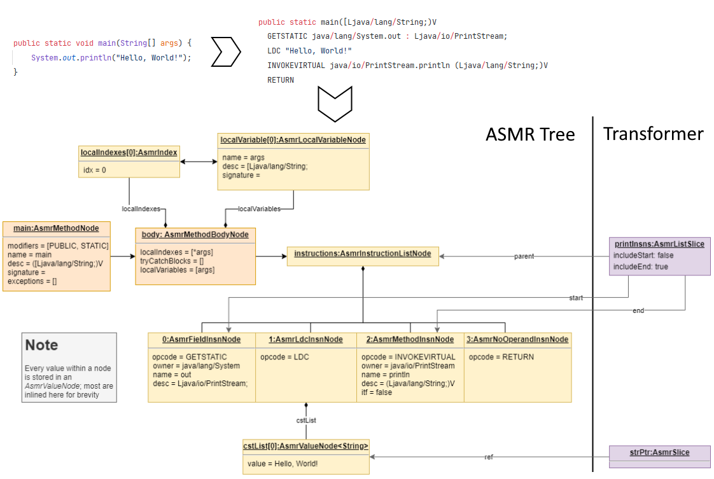

## Summary

This RFC is part of a series aiming to define and prototype the ASM-Regex project. It expands upon [RFC-0003](https://github.com/QuiltMC/rfcs/pulls/3) by proposing a design for the processor, a backend module that loads transformers and applies them as needed to a given classpath.

## Motivation

ASM-Regex would be based on two key kinds of components:

- **Processor** - a backend library which applies *transformers* to the application's bytecode.
- **Compiler** - a piece of software which can take in some form of input (annotated classes, domain-specific language, etc.)  and turn them into *transformers* usable by the processor.

*Transformers* present themselves as classes loadable by the JVM that can transform the ASMR tree provided by the processor. Those would be invisible to modders, being only generated by compilers as intermediary objects to be executed by the processor.

### Requirements

*The key words "MUST", "MUST NOT", "REQUIRED", "SHALL", "SHALL NOT", "SHOULD", "SHOULD NOT", "RECOMMENDED",  "MAY", and "OPTIONAL" in this document are to be interpreted as described in [tools.ietf.org RFC 2119](https://tools.ietf.org/html/rfc2119)*

- The processor **must** generate a data structure representing the bytecode from all classes belonging to a given classpath
- The processor **must** load a predefined list of transformers
- The processor **must** offer ways to tweak the order in which transformers are loaded and applied
- The processor **must** allow transformers to factor other transformations into their own
- The bytecode processing system **must** be deterministic given a game version, a set of mods, and a set of config properties
- The processor **should not** verify the output bytecode; this task is left to the JVM's verifier. Compilers should ensure the generated transformers generate bytecode that is valid and well-formed.

## Explanation

### Implementation

#### Class representation

Many nodes in the tree representation of a class (`org.objectweb.asm.tree`) count as "symbols" that can be matched against and replaced. Mixin has the concept of matching an `AbstractInsnNode` using custom injection points, here we generalize this concept to be able to match against and transform everything from whole `MethodNode`s, all the way down to individual fields of an instruction, such as the operand to an `ALOAD` instruction.

The granularity of the tree structure is a key point of this design. Individual operands to instructions are treated the same conceptually to a whole instruction node, which is treated the same as a whole method node in a class.

A "slice" is a pointer to one or more sequential nodes. It can be one of two types:

- `AsmrSlice`: references a single node
- `AsmrListSlice`: references a parent list, a start node within the list, and an end node within the list.
  - To better account for changes to the node list made by other transformers, list slices can choose whether they include the start and end nodes. For example here, pointing right after the field instruction node is not the same thing as pointing right before the load constant instruction node because, if another transformer injects between those two nodes, the new nodes will be included in the former case but not in the latter case. 

For a slice of instructions in a method (similar to what mixin has), the parent is the method instruction list ("body"), and the start and end indexes are into that instruction list. There can also be a slice of fields or methods in a class, and a slice of operands in a single instruction. If a single symbol needs to be targeted, it is represented as a slice of length 1. You can also have a slice of length 0, where the start index equals the end index.

#### Processor phases

// 2 orderings : general order (read+write) calculated from a dependency graph, and write order

The processor phases are split into two phases (actually it's more complicated than this, more on that later). We first have the read phase and then we have the write phase.

When a class is transformed, the read phase is first invoked for all transformers. This is when all transformers inspect the tree of the class and collect a set of slices they are interested in. Also in this phase, the transformers are allowed to tell the processor certain things about the slices they identify. For example, a transformer could tell the processor that a certain slice must not be modified by any other transformer during the write phase. No modification to the class tree happens in this phase.

In the read phase, each transformer also tells the processor about the writes it plans to do during the write phase (along with which write function to use in each case, see below). Note that this means that between the read phase and the write phase, the processor can detect inter-mod conflicts, which are defined as one processor marking a slice for write which overlaps a slice that another processor marked as cannot-be-modified.

In the write phase, all planned writes are invoked. A "write" is defined as replacing a slice with another "replacement" tree. The replacement tree can be constructed from literal values or can have subtrees substituted with slices that were gathered during the read phase (this is called "capturing"). A tree can of course be constructed from literal values in some places and captured slices in others. Note that you can inject without replacing any code by replacing an empty slice.

For example, let's say you want to capture a local variable. In the read phase, you can identify a local variable by an `aload x` instruction somewhere (which may be nearby to some interesting piece of code), and capture the `x` operand in a slice. Then, in a write, you can read and write that variable by substituting the captured slice containing `x` into an `aload` or `astore` instruction.

#### Order of operations

With the aforementioned features, you can implement most of what Mixin supports (and a lot more too). However there are one or two things unanswered, and that's "priority", and what about if some transformer is designed to read or modify the code *after* some or all transformation has taken place?

As of writing this draft, the basic idea is that write operations can be given some way to declare their ordering, so that the writes can be applied in a way that honours something equivalent to Mixin's priority system. Additionally, there may be a number of read phases and write phases happening in alternation for transformers that declare they want to work on partially or fully transformed code.

#### Format

Transformers in the backend need to be very flexible to be able to support all these features. The initial idea is that the read phase, and probably the write phase too, need something close to a Turing machine to be implemented properly. But at that point, since they are basically executing code anyway, why not make the backend format... Java bytecode? A transformer implements a Java interface, the read method is called during the read phase, which passes method references back to the transformer to be executed during the write phase. The implementation of a transformer may capture slices using fields in that class.

There is one clear disadvantage to using Java bytecode as the target format for the backend, and that's that it means you could implement a transformer directly in Java if you wanted to. The way to discourage this would be to offer attractive frontend solutions that do the same thing as what they would want to do with the backend, so why do it the hard way?

In addition, what is the *real* problem with people doing what they're not supposed to and compiling Java to the backend directly? After all, the read-write paradigm in the backend is designed to have inter-mod safety, so even if someone manages to write a transformer in Java they are not likely to break anything that way. No, the *real* problem is that the backend isn't designed to be easy to write code in, and it may be easy to forget to do things, such as marking slices as unmodifiable. Also, there aren't rigorous checks in the backend against creating broken bytecode. Both of these checks are the responsibility of the compiler.

The problem could also be mitigated by putting illegal Java identifier characters in the interface method(s) that need to be implemented.

<!--For technical changes, such as changes to APIs, first give an overview of how
this proposed change would work. Explain how it would be used, with code
examples. Then, give a more in depth explanation of how it would be implemented
and how it would interact with other parts of the project and other Quilt
projects.-->

## Drawbacks

Why should we not do this?

## Rationale and Alternatives

- Instead of using a dedicated processor, transformers could be self-contained executables that each scan the classpath
- Being able to create transformers in Java seems like a relatively small price to pay. While there is always the option of a Turing machine, it would require writing and maintaining a separate parser library.

<!--Why is this the best possible design?/What other designs are possible and why should we choose this one instead?/What other designs have benefits over this one? Why should we choose an alternative instead?/What is the impact of not doing this?-->

## Prior Art

- Mixin
- Forge's patches
- ASM's Tree API

<!--If this has been done before by some other project, explain it here. This could be positive or negative. Discuss what worked well for them and what didn't. There may not always be prior art, and that's fine.-->

## Unresolved Questions

- Labels. We need a way to create labels and substitute them. Maybe this could mean that the actual substitution trees are created in the read phase, but not actually substituted until the write phase?

### Out of scope for this RFC

- What should the frontend look like?
- How are compilers implemented?
	- This document's purpose is to propose a design for the processor backend. The task of designing one or more compilers is left to a future proposal.

## Expected Response

<!--How do might the wider community respond to this change? Who will be affected by it and how? Who has advocated for this change? Who has advocated against it?-->